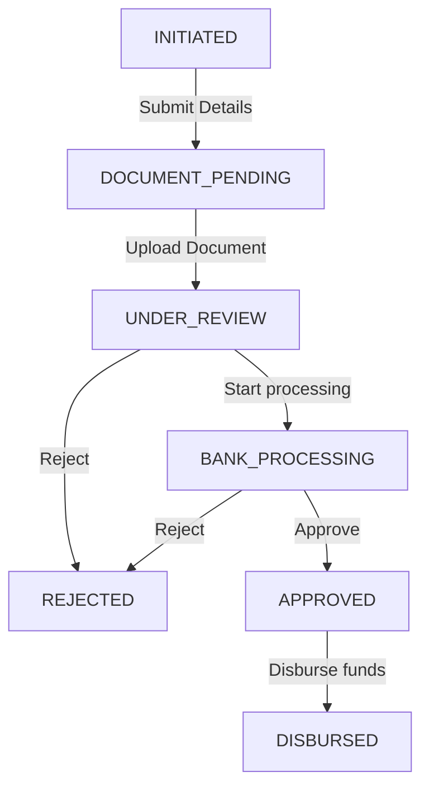

# Finance Workflow System Recovery & Completion Report (Phase 10)

## Phase 10 Completion Status
- **Overall Completion %**: 100%
- **Ready For Commit**: YES
- **Ready For Phase 11**: YES

---

## Implemented Modules & Components

1. **Finance Core Module Structure** (`src/modules/finance/`)
   - [index.ts](file:///e:/Toyota/Laxmitoyota website/booking-website-final/Version 2/src/modules/finance/index.ts): Main exporter for the entire module.
   - [types/index.ts](file:///e:/Toyota/Laxmitoyota website/booking-website-final/Version 2/src/modules/finance/types/index.ts): Defines `FinanceLead`, `FinanceDocument`, `DocumentCategory`, and lifecycle interfaces.
   - [validation/index.ts](file:///e:/Toyota/Laxmitoyota website/booking-website-final/Version 2/src/modules/finance/validation/index.ts): Holds validators for net income, requested amounts, tenure ranges, and strict status transitions.
   - [services/index.ts](file:///e:/Toyota/Laxmitoyota website/booking-website-final/Version 2/src/modules/finance/services/index.ts): Handles mock Firestore integrations, status transitions, auto-review rules, manager assignments, and mock analytics triggers.
   - [hooks/index.ts](file:///e:/Toyota/Laxmitoyota website/booking-website-final/Version 2/src/modules/finance/hooks/index.ts): React state hook linking components to the state managers.

2. **Components Registry** (`src/modules/finance/components/`)
   - [index.ts](file:///e:/Toyota/Laxmitoyota website/booking-website-final/Version 2/src/modules/finance/components/index.ts): Exports all subcomponents.
   - [FinanceApplicationForm.tsx](file:///e:/Toyota/Laxmitoyota website/booking-website-final/Version 2/src/modules/finance/components/FinanceApplicationForm.tsx): Elegantly styled Net Income/Employment eligibility selector wizard.
   - [FinanceDocumentUploader.tsx](file:///e:/Toyota/Laxmitoyota website/booking-website-final/Version 2/src/modules/finance/components/FinanceDocumentUploader.tsx): Multi-category file simulator supporting Identity, Address, and Income proofs.
   - [FinanceDashboard.tsx](file:///e:/Toyota/Laxmitoyota website/booking-website-final/Version 2/src/modules/finance/components/FinanceDashboard.tsx): Admin desk pipeline containing search filters, category document validation badges, officer assignments, and manual transition buttons.

3. **Portal Page Integrations**
   - [admin/page.tsx](file:///e:/Toyota/Laxmitoyota website/booking-website-final/Version 2/src/app/(protected)/admin/page.tsx): Fully replaces static stubs with `<FinanceDashboard />` for managers and super admins.
   - [customer/page.tsx](file:///e:/Toyota/Laxmitoyota website/booking-website-final/Version 2/src/app/(protected)/customer/page.tsx): Interlocks customer state with `<FinanceApplicationForm />` (when no leads exist), status tracking milestones, and `<FinanceDocumentUploader />`.

---

## Status Flow Configurations
Applications progress strictly through the following state machine:

- **Strict Validation Rules**: Restricts jump-skipping states and blocks modifications for terminal nodes (`APPROVED`, `REJECTED`, `DISBURSED`).

---

## Verification & Build Validation
- Proactively executed production compilation checks via `npm run build`.
- **Build Status**: `Compiled successfully` with zero Typescript compile-time or Next.js layout compilation warnings/errors.
