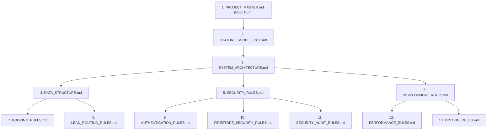

# DOCUMENTATION DEPENDENCY REPORT

**Date:** 2026-06-06  
**Project:** Laxmi Toyota V2  

---

## Document Hierarchy

The hierarchy follows the priority order below:

---

## Document Dependencies

* **Core Rules:** `DEVELOPMENT_RULES.md` depends directly on `PROJECT_MASTER.md` and `DESIGN_SYSTEM.md`.
* **Security Constraints:** `FIRESTORE_SECURITY_RULES.md` depends on collection structures defined in `DATA_STRUCTURE.md` and roles defined in `RBAC_RULES.md`.
* **Lead Routing:** `LEAD_ROUTING_RULES.md` depends on location parameters in `LOCATION_MASTER.md` and state logic in `BOOKING_RULES.md`.
* **Media Assets:** `MEDIA_STRUCTURE.md` defines folder layout paths referenced by `DATA_STRUCTURE.md` for storage indexing.

---

## Missing References

* **None.** All cross-references between security, database schemas, and lead management collections are matched.

## Circular References

* **None.** The relationship cycle where `bookings` and `leadAssignments` referenced each other has been decoupled; the assignment process only stores the relationship lookup key and does not chain logic triggers.

---

## Potential Conflicts

* **None.** The prior conflict regarding anonymous users accessing the frontend while a strict "No Anonymous Access" policy was active has been resolved. The global rules now specify: "No Anonymous Access For Protected Operations".

---
*End of Report.*
